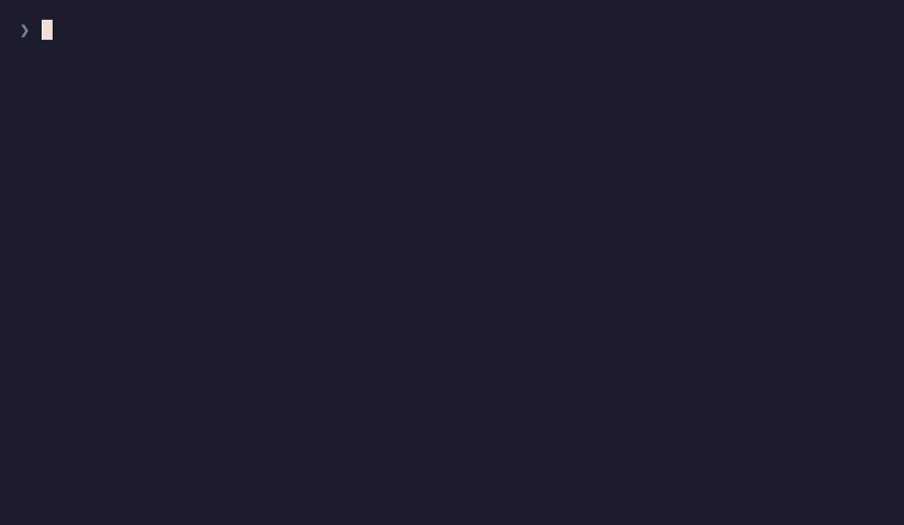
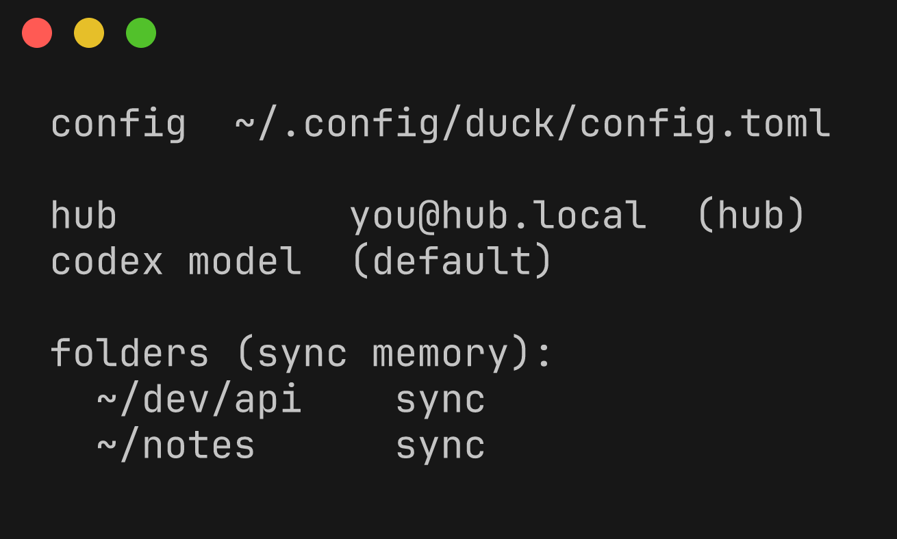

# duck 🦆

**A remote hub that feels local.** `cd` into a project, type `duck`, and you're
dropped into a remote `tmux` session on a beefy always-on "hub" machine — with
your directory transparently mirrored there and kept in sync. It's like running
`claude` (or anything) on another box, except your files are already there and
stay there.

duck is **tool-agnostic** — it manages remote *workspaces* (a synced directory +
a tmux session), not any particular program. Run claude, codex, a build, a
shell — whatever. There's **no daemon and no database**: a duck session *is* a
tmux session on the hub; sync is [Mutagen](https://mutagen.io); the laptop
binary just drives the hub over SSH.

<p align="center">
  
  <br>
  <sub><code>duck</code> syncs the folder and drops you into a remote session · <code>duck --resume</code> picks one back up</sub>
</p>

## Install

```sh
curl -sSL https://raw.githubusercontent.com/DigiBugCat/duck/main/install.sh | sh
```

That drops a raw binary at `~/.local/bin/duck` (no Homebrew). From then on duck
keeps itself current: **every run does a throttled background check and
self-updates in place** when a newer GitHub release exists (the next run uses
it). It's on by default — turn it off with `duck config auto-update off` or
`DUCK_NO_AUTO_UPDATE=1`, and from-source `dev` builds never auto-update. `duck
update` still forces an update on demand. Also install
[Mutagen](https://mutagen.io) — the only runtime dependency on your laptop
(`rsync`, `ssh` and `tmux` come from macOS / the hub):

```sh
brew install mutagen-io/mutagen/mutagen
```

macOS, Apple Silicon + Intel. If you previously installed duck via the old brew
cask, remove it so it doesn't shadow this one: `brew uninstall --cask duck`.

## Quickstart

```sh
duck setup                 # interactive: point duck at your hub (user@host or ssh alias),
                           # it installs tmux + mutagen there and is ready
cd ~/dev/my-project
duck                       # sync this dir to the hub → open a remote session → you're in
```

That's it. From then on:

```sh
duck            # in a project: sync (if needed) + a fresh remote session here
duck -c         # reattach the session you were last in (this terminal), or the most recent for this dir
duck --resume   # a picker of all your sessions  (type to filter, ⏎ attach)
duck ls         # list sessions without attaching
```

## How it works (the model)

- **A session is a remote tmux session.** No hub daemon, no database. Liveness,
  attached-state, age, and window count are read live from `tmux`.
- **Sync is continuous and decoupled from sessions.** Once a directory is set up,
  Mutagen keeps it synced **both directions, in the background, forever** — even
  when you have no duck session open, and it survives reboots. A change on the
  hub shows up on your laptop within seconds, and vice-versa. `duck` sets up the
  sync once; Mutagen maintains it.
- **One small piece of state:** `~/.duck/names.json` **on the hub** — the
  display-name map. The laptop is its single writer.
- **Names are clean and yours.** The picker shows a raw display name (spaces,
  caps, emoji — no slug), with precedence **your name ▸ codex-generated ▸
  directory name**.

## Sync-awareness

`duck` never blindly mirrors a directory:

- a **small / already-synced / remembered** folder auto-syncs and drops you in;
- a **large, home, or root** folder it hasn't seen **prompts first** (default
  *no*) so you never kick off a multi-GB mirror by accident;
- it **remembers** your choice per folder; `duck --sync` / `duck --no-sync`
  override and remember;
- a non-interactive run (pipe / CI) never hangs on a prompt.

If the hub *already* has the folder with files (e.g. you sync the same notes
vault from several machines), duck offers a **newest-wins merge**: per file, the
**newest version wins** and unique files from both sides are kept — **nothing is
deleted** (`rsync -a -u`, no `--delete`; then Mutagen maintains it).

## Claude history sync (opt-in)

If you run `claude` on *both* your laptop and the hub, their session histories
normally live on whichever machine ran them. Turn this on and duck makes each
folder's Claude corpus follow you:

```sh
duck config claude-sync on
```

From then on, whenever `duck` mirrors a folder it **also co-syncs that folder's
`~/.claude/projects/<slug>/`** — its transcripts *and* its auto-memory —
bidirectionally, scoped to the folders you actually duck into (not your whole
`~/.claude`). It works because duck guarantees the same `$HOME` on both machines,
so Claude's path-encoded project slug lines up automatically.

- **Off by default** — it ships terminal transcripts to the hub, a real data flow.
- **Per-folder & lazy** — only folders you duck into are synced, and only once
  Claude has actually written that folder's corpus.
- **Newest-wins merge** — the same project's history from another machine is
  merged per-file (newest wins, nothing deleted), then Mutagen maintains it.
- **Why only `projects/`?** The rest of `~/.claude` (and `~/.codex`) holds live
  SQLite DBs, credentials, and append-only logs that **corrupt or leak** under
  bidirectional file-sync. `projects/` is the one conflict-safe, single-writer
  slice — so that's the only thing duck touches. (`codex` history is *not* synced:
  its resume picker is driven by an index/DB that can't be safely two-way synced.)

## Naming & privacy

Session naming is **opt-in per folder** (toggle via `duck config`). When enabled,
duck captures up to ~8 KB of the *head* of the session's terminal pane and sends
it to a local `codex` model to generate a short title — so **terminal content is
transmitted to the codex provider** only for folders you've opted in. With codex
absent or naming off, duck falls back to the directory name. Naming runs on your
laptop; codex is **not** required on the hub.

## Commands

| Command | What it does |
|---|---|
| `duck [folder]` | sync the folder (cwd by default) + open a new remote session + attach |
| `duck -c` / `--continue` | reattach this terminal's last session, or the most recent for this dir |
| `duck --resume [name]` | picker over your sessions (no arg) / attach a named one |
| `duck ls` | list remote sessions without attaching |
| `duck rename <s> <name…>` | set a raw display name for a session |
| `duck kill <name>` / `duck clean` | kill one / all detached-idle sessions |
| `duck evict [--age 12h]` | evict stale sessions to save hub RAM — still resumable from the picker (⊘ rows recreate the session and `claude --resume` its conversation) |
| `duck evict --install [--age 12h] [--every 30m]` | install the sweep as a launchd agent on the hub so it evicts on its own (`--uninstall` removes it) |
| `duck snap` | capture a screen selection → upload it to the hub → copy the remote path to your clipboard (paste into a Claude session on the hub) |
| `duck config` (`path`, `edit`) | show / locate / edit the config (hub, codex model, per-folder policy) |
| `duck config claude-sync on\|off` | toggle per-folder Claude history sync (transcripts + memory) to the hub |
| `duck config attach-transport auto\|ssh\|tssh` | interactive-attach transport — `auto` (default: tssh if the client is installed, else ssh), `ssh` (force), or `tssh` (force, UDP/QUIC roaming) |
| `duck hub set/setup/show` | set, provision, or print the hub |
| `duck setup` | the interactive first-run wizard |
| `duck sync …` | explicit Mutagen bundles: `new/add/get/ls/show/rm/drop/status/prune` |

**Picker keys:** `↑`/`↓` move · `⏎` attach · `^s` this-dir scope · `^a` all ·
`^r` rename · `^n` name-now · `^k` kill · `^c` quit · *type to filter*.

`duck config` shows where you're pointed and what's remembered:

<p align="center">
  
</p>

## Screenshots into a remote Claude

Claude Code reads images from the clipboard of the machine it runs on — which,
over duck, is the hub, not your laptop. `duck snap` bridges that: it captures a
selection locally (macOS `screencapture`, like ⌘⇧4), streams the PNG to the hub
over duck's multiplexed SSH (into `/tmp/duck-shots`), and copies the **remote
path** to your laptop clipboard. Paste that path into a Claude session on the
hub and ask about it — Claude reads the image by path.

```sh
duck snap            # drag a region → path is on your clipboard → ⌘V into Claude
duck snap --full     # whole screen instead of a selection
```

For a one-key capture, run:

```sh
duck snap install-hotkey   # installs Hammerspoon if needed + the Cmd+Shift+3 binding
```

It installs Hammerspoon (via Homebrew) if it's missing and writes a
`Cmd+Shift+3` → `duck snap` binding from duck's **embedded** copy
(`assets/hammerspoon-snap.lua`) into `~/.hammerspoon/` — so every Mac gets the
identical hotkey from `duck update`, never a hand-copied file. Then free up ⌘⇧3
(System Settings → Keyboard → Keyboard Shortcuts → Screenshots → uncheck "Save
picture of screen as a file"), grant Hammerspoon Accessibility + Screen
Recording, and Reload Config. (Prefer no extra app? macOS Shortcuts works too —
bind a "Run Shell Script: `duck snap`" shortcut to any key.)

## Resilience

If the connection drops while you're attached (sleep, network change), duck
**reconnects automatically** with capped exponential backoff and drops you back
into the same session when the network returns. `^c` gives up to your local shell
— and remembers that session for *this terminal*, so `duck -c` resumes exactly
it.

duck runs the **interactive attach over [tssh](https://github.com/trzsz/trzsz-ssh)**
(trzsz-ssh) instead of `ssh -t` whenever the `tssh` client is installed on your
laptop — UDP/QUIC transport with seamless roaming across network changes and
sleep (no reconnect backoff; QUIC just keeps up), plus intact scrollback. It's
**automatic**: the default transport is `auto`, so a client opts in just by
`brew install trzsz-ssh` — the hub always supports it (`duck setup` installs
`tsshd`), so no per-client config is needed. Only the interactive attach moves:
the **SSH control plane stays on ssh** (sync forwards, the `duck-open` opener,
naming, provisioning). `duck hub setup` detects the hub's `tsshd` path and the
attach passes it via `--tsshd-path`, so the hub finds `tsshd` even when it lives
off the default PATH (Homebrew on Apple Silicon); on a Linux hub tssh deploys
`tsshd` itself on first connect. Works great over Tailscale, which carries the
UDP for you. To override the auto-detect: `duck config attach-transport ssh`
forces ssh even with tssh installed; `tssh` forces tssh and warns + falls back to
ssh if the client is missing.

## Requirements

- **Laptop:** macOS, `mutagen` (`brew install mutagen-io/mutagen/mutagen`);
  `codex` optional (naming only); `tssh` optional but recommended — install it
  (`brew install trzsz-ssh`) and the attach auto-upgrades to tssh (UDP/QUIC
  roaming).
- **Hub:** any always-on macOS box reachable over SSH; `duck setup` provisions
  `tmux` + `mutagen` + `tsshd` + TPM for you. Same `$HOME`/username on both
  machines (duck mirrors each path at its natural location).

## License

MIT © DigiBugCat
