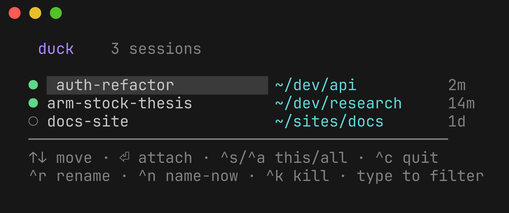

# duck 🦆

**A remote hub that feels local.** `cd` into a project, type `duck`, and you're
dropped into a remote `tmux` session on a beefy always-on "hub" machine — with
your directory transparently mirrored there and kept in sync. It's like running
`claude` (or anything) on another box, except your files are already there and
stay there.

duck is **tool-agnostic** — it manages remote *workspaces* (a synced directory +
a tmux session), not any particular program. Run claude, codex, a build, a
shell — whatever. There's **no daemon and no database**: a duck session *is* a
tmux session on the hub; sync is [Mutagen](https://mutagen.io); the laptop
binary just drives the hub over SSH.

<p align="center">
  
  <br>
  <sub><code>duck --resume</code> — your remote sessions, clean names, type to filter</sub>
</p>

## Install

```sh
brew install DigiBugCat/tap/duck
```

That pulls `mutagen` (the only runtime dependency on your laptop — `rsync`, `ssh`
and `tmux` come from macOS / the hub). macOS, Apple Silicon + Intel.

## Quickstart

```sh
duck setup                 # interactive: point duck at your hub (user@host or ssh alias),
                           # it installs tmux + mutagen there and is ready
cd ~/dev/my-project
duck                       # sync this dir to the hub → open a remote session → you're in
```

That's it. From then on:

```sh
duck            # in a project: sync (if needed) + a fresh remote session here
duck -c         # reattach the session you were last in (this terminal), or the most recent for this dir
duck --resume   # a picker of all your sessions  (type to filter, ⏎ attach)
duck ls         # list sessions without attaching
```

## How it works (the model)

- **A session is a remote tmux session.** No hub daemon, no database. Liveness,
  attached-state, age, and window count are read live from `tmux`.
- **Sync is continuous and decoupled from sessions.** Once a directory is set up,
  Mutagen keeps it synced **both directions, in the background, forever** — even
  when you have no duck session open, and it survives reboots. A change on the
  hub shows up on your laptop within seconds, and vice-versa. `duck` sets up the
  sync once; Mutagen maintains it.
- **One small piece of state:** `~/.duck/names.json` **on the hub** — the
  display-name map. The laptop is its single writer.
- **Names are clean and yours.** The picker shows a raw display name (spaces,
  caps, emoji — no slug), with precedence **your name ▸ codex-generated ▸
  directory name**.

## Sync-awareness

`duck` never blindly mirrors a directory:

- a **small / already-synced / remembered** folder auto-syncs and drops you in;
- a **large, home, or root** folder it hasn't seen **prompts first** (default
  *no*) so you never kick off a multi-GB mirror by accident;
- it **remembers** your choice per folder; `duck --sync` / `duck --no-sync`
  override and remember;
- a non-interactive run (pipe / CI) never hangs on a prompt.

If the hub *already* has the folder with files (e.g. you sync the same notes
vault from several machines), duck offers a **newest-wins merge**: per file, the
**newest version wins** and unique files from both sides are kept — **nothing is
deleted** (`rsync -a -u`, no `--delete`; then Mutagen maintains it).

## Naming & privacy

Session naming is **opt-in per folder** (toggle via `duck config`). When enabled,
duck captures up to ~8 KB of the *head* of the session's terminal pane and sends
it to a local `codex` model to generate a short title — so **terminal content is
transmitted to the codex provider** only for folders you've opted in. With codex
absent or naming off, duck falls back to the directory name. Naming runs on your
laptop; codex is **not** required on the hub.

## Commands

| Command | What it does |
|---|---|
| `duck [folder]` | sync the folder (cwd by default) + open a new remote session + attach |
| `duck -c` / `--continue` | reattach this terminal's last session, or the most recent for this dir |
| `duck --resume [name]` | picker over your sessions (no arg) / attach a named one |
| `duck ls` | list remote sessions without attaching |
| `duck rename <s> <name…>` | set a raw display name for a session |
| `duck kill <name>` / `duck clean` | kill one / all detached-idle sessions |
| `duck config` (`path`, `edit`) | show / locate / edit the config (hub, codex model, per-folder policy) |
| `duck hub set/setup/show` | set, provision, or print the hub |
| `duck setup` | the interactive first-run wizard |
| `duck sync …` | explicit Mutagen bundles: `new/add/get/ls/show/rm/drop/status/prune` |

**Picker keys:** `↑`/`↓` move · `⏎` attach · `^s` this-dir scope · `^a` all ·
`^r` rename · `^n` name-now · `^k` kill · `^c` quit · *type to filter*.

`duck config` shows where you're pointed and what's remembered:

<p align="center">
  
</p>

## Resilience

If the connection drops while you're attached (sleep, network change), duck
**reconnects automatically** with capped exponential backoff and drops you back
into the same session when the network returns. `^c` gives up to your local shell
— and remembers that session for *this terminal*, so `duck -c` resumes exactly
it.

## Requirements

- **Laptop:** macOS, `mutagen` (installed by the brew formula); `codex` optional
  (naming only).
- **Hub:** any always-on macOS box reachable over SSH; `duck setup` provisions
  `tmux` + `mutagen` + TPM for you. Same `$HOME`/username on both machines (duck
  mirrors each path at its natural location).

## License

MIT © DigiBugCat
